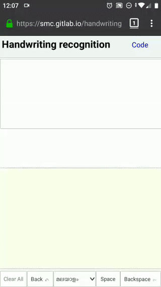

Handwriting recognition for Malayalam, Tamil
============================================

This is online handwriting recognition and input tool for Malayalam and Tamil.

How it works
------------
The core logic of recognition is curve matching. We have a saved version of curves for each ligatures of Malayalam. This is matches against the curves users are drawing in the writing pad.

Since people write the letters in so many random ways, the curve matching should take care of these variations. Scaling up or down, rotation, distortions in the curve, some amount of flexibility for errors etc. For this kind of curve matching we use https://github.com/chanind/curve-matcher which is a https://en.wikipedia.org/wiki/Procrustes_analysis based curve matching implementation.

Here is a blog post explaining this in detail: [Procrustes Analysis Based Handwriting Recognition](https://thottingal.in/blog/2020/02/29/procrustes-analysis-based-handwriting-recognition/)

Try out
-------

https://smc.gitlab.io/handwriting

Training
--------

To add a letter, prepare an svg with the corresponding path. Add that to the training directory along with existing svgs. Edit ehe data.json file there and give the svg file name and letter.
Then run `make` in the training directory. Now on wards any strokes similar to the path in svg will be recognized. Note the direction of stroke in the svg is important. You can also add any number of different writing styles as separate SVG files.

Building the application
------------------------

After checking out the source code. Run `npm install` to install all dependencies and building tools. Then run `npm run build`. You will see a dist folder created and production ready js library in it. Access `index.html` to see this in action.
